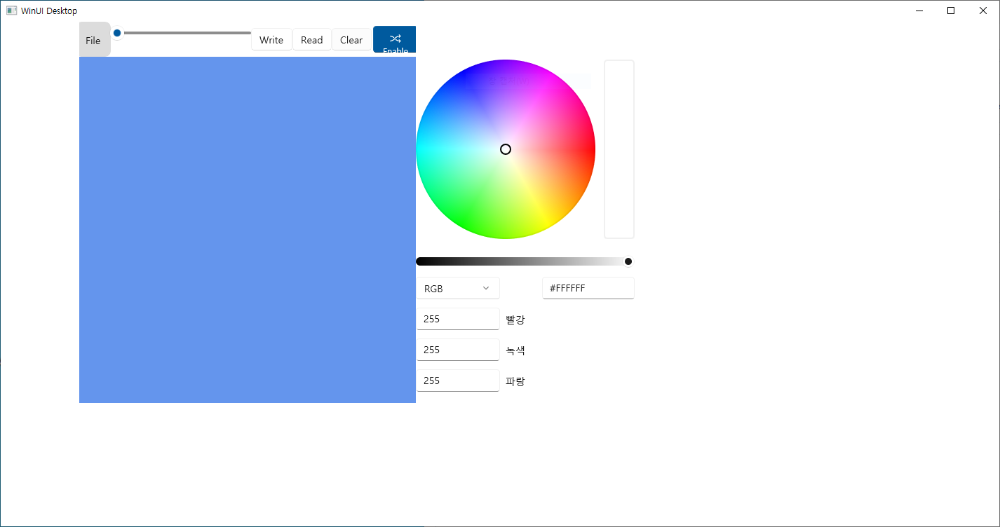
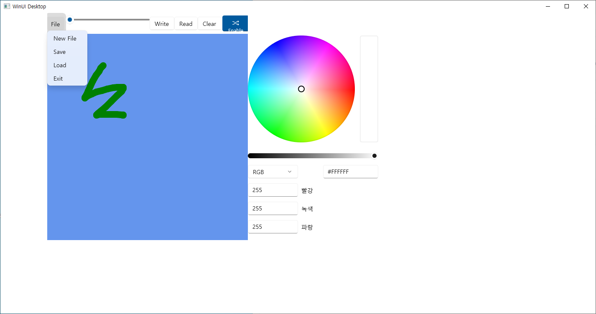
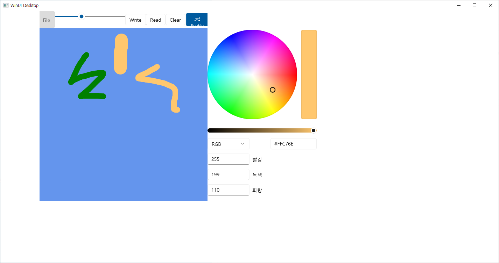

# 비주얼프로그래밍 팀프로젝트 PenPaint 제작
20191276 컴퓨터공학과 양용석

기능 
1. 펜을 만들어 마우스로 선을 그릴 수 있다. 
2. 슬라이더바로 굵기를 조절할 수 있다.
3. 색상을 선택할 수 있다.
4. 슬라이더바와 컬러선택 창을 보이거나 지울 수 있다.
5. 데이터를 저장할 수 있다.
6. 데이터를 읽을 수 있다.

실행 화면

 
 
 
